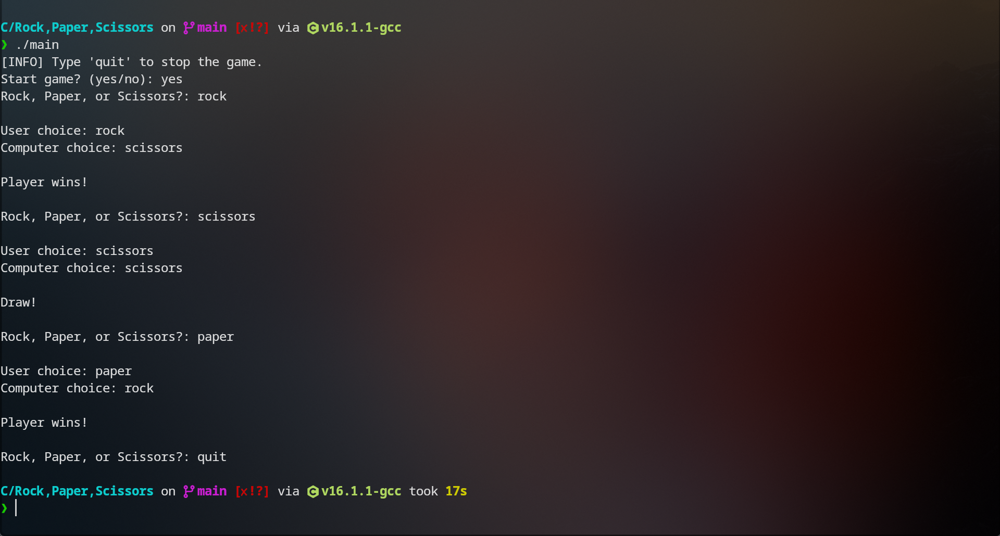

# C
The purpose of this repository is to demonstrate my familiarity, and ongoing projects with the C programming language.

[Projects]
1. Rock, Paper, Scissors

Objective: 
To practice my C fundamentals by doing the rock, paper, scissors project. By doing this project, I soldified core concepts like user input, arrays, loops, conditional logic and so forth.

How to Run:
1. Compile the program
gcc main.c -o main

2. Run the program
./main

Result:

    

